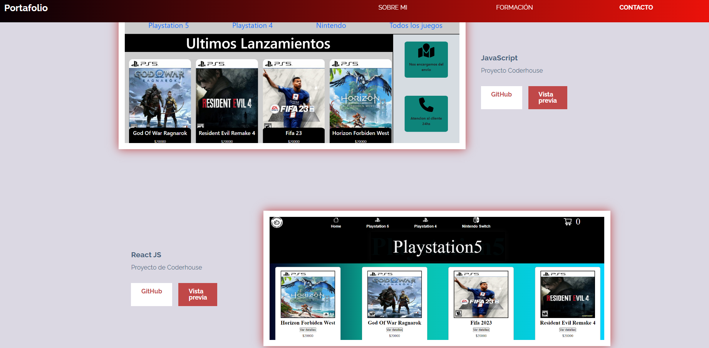

# Desafío Alura Oracle 2: Portafolio

Armado de un portafolio personal con formulario de contacto, formación académica,  skills, banner de presentación y datos sobre mi.

## Elementos utilizados:

- HTML y CSS
- JavaScript para las validaciones y algunas animaciones
- Standard linter para correcciones sobre el código JavaScript
- [Animista](https://animista.net/) para las animaciones
- [Palettes](https://palettes.shecodes.io/) para los colores
- [IconScout](https://iconscout.com/) para los íconos
- [UiGradients](https://uigradients.com/#Titanium) para gradientes

## Conocimientos aplicados

- Mobile First
- Metodología BEM
- Flexbox
- Layouts Responsivos
- Manipulación del DOM
- Variables CSS
- Validaciones y mensajes de error
- Medidas relativas: REM, VH, VW y Porcentaje

## Muestra de las Animaciones

#### SOBRE MI VERSION ESCRITORIO / MOVIL 

#### Skills VERSION ESCRITORIO / MOVIL

#### Proyectos en Tecnología VERSION ESCRITORIO / MOVIL

